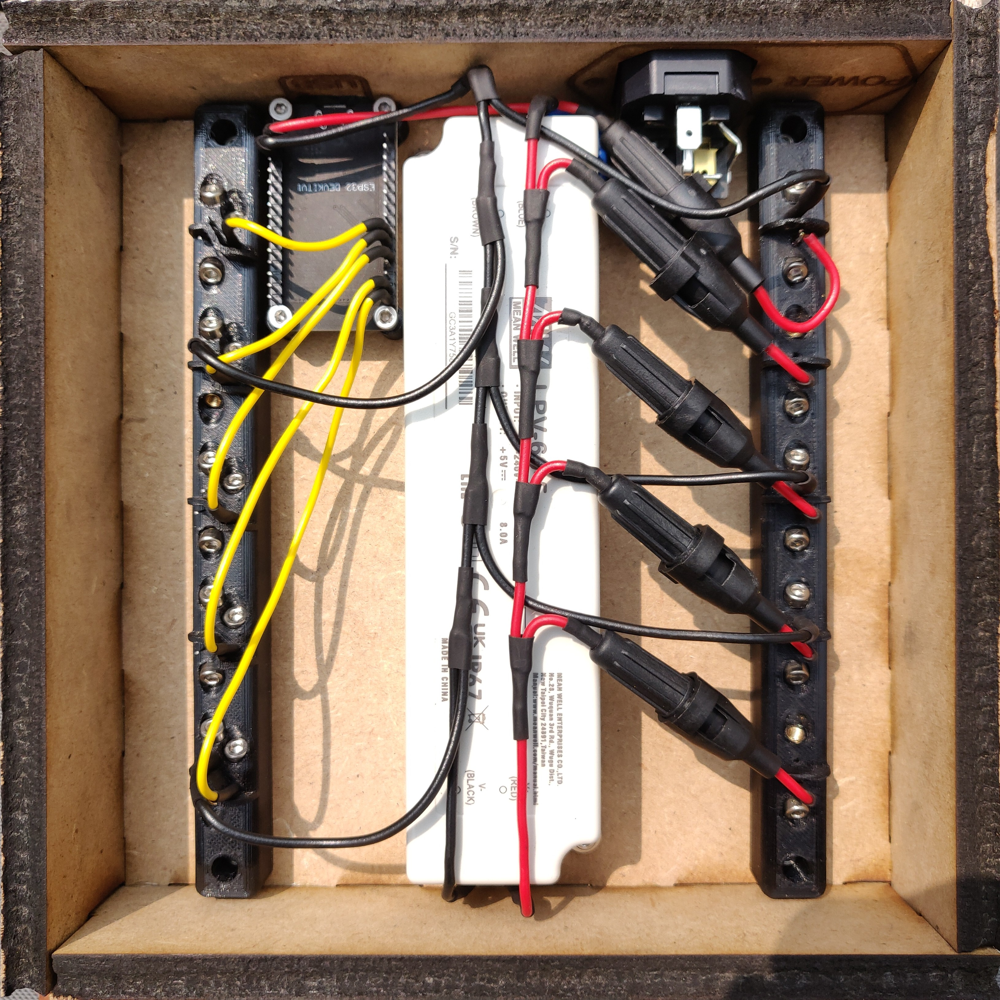

# Project-1-Elektronica

This is the code used to instruct our ESP32 Microcontroller for our 5x5x5 Led Cube

## Fusion 360
 
 

## Result
 

## Demo

<video width="30%" controls>
  <source src="1row.mp4" type="video/mp4">
</video>

<video width="30%" controls>
  <source src="5x5window.mp4" type="video/mp4">
</video>

<video width="30%" controls>
  <source src="cube.mov" type="video/mp4">
</video>
